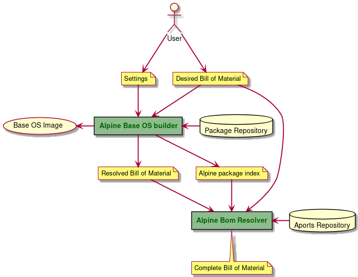

# bomres - A Software Bill-of-Material Resolver

## Overview

bomres is a Software Bill-of-Material (SBoM) Resolver specifically designed for Alpine-based container images. It allows to create a detailed SBOM based on two sets of information:

1. A short list of key software dependencies which must be present in a resulting Alpine image, and
2. build meta-data taken from the Alpine aports repository.

bomres processes, correlates and combines these information in conjunction with information provided by the apk package manager to generate a detailed SBoM, exposing more information about the image than provided by the package manager itself. In particular, the resulting SBoM containes information about the location of the source code of a package, patches applied by the Alpine community and security information.


### Architecture

bomres consists of two components:

1. an **Alpine image builder** which creates an Alpine image containing all packages (and their dependencies) listed in a "desired bill-of-material" file, and
2. the actual **SBoM resolver** which uses information provided by the Alpine package manager and generated during the previous build process and combines these with additional meta-data hosted in the Aports repository.

### Workflow

The overall workflow is shown in the figure below:



### Deployment options

bomres can be deployed in three different scenarios:

1. As a standalone toolset packaged in two containers,
2. As a standalone service exposing a RESTful API, or
3. As a scalable service deployed on Kubernetes

More detailed documentation on how to deploy each scenario to come soon.


## Usage

### Containerized tool

To run bomres as a containerized toolset, perform the following steps:

```bash
$ docker run -it --rm docker.io/bomres/base_os_alpine make > Makefile
$ make config
$ vim alpine/build/base_os/config/packages
$ vim alpine/build/base_os/config/settings
$ make build
$ make resolve
```

### Standalone local service

```bash
$ docker run -it --rm docker.io/bomres/alpine_resolver make > Makefile
$ make service &
$ make build
```

### Scalable service deployed on Kubernetes

To be added soon.


## Contributing

bomres is current in early stages and primarily meant to demonstate the concept. All contributions, PRs, issues, comments, are welcome.

### Building from source

To build the alpine image builder and the sbom-resolver container, run the following steps:

```bash
$ cd bomres
$ make -C tools/base_os_alpine local
$ make -C services/sbom_resolver build
```

### Testing a source build

To test a local build of bomres, run the following:

```bash
$ docker run -it --rm base_os_alpine:<TAG> make > Makefile
$ sed -i 's/docker.io\/bomres\///g' Makefile
$ <potentially modify image tags>
$ make config
$ vim alpine/build/base_os/config/packages
$ vim alpine/build/base_os/config/settings
$ make build
$ make resolve
```


## License

bomres is available under the Apache 2.0 license.
